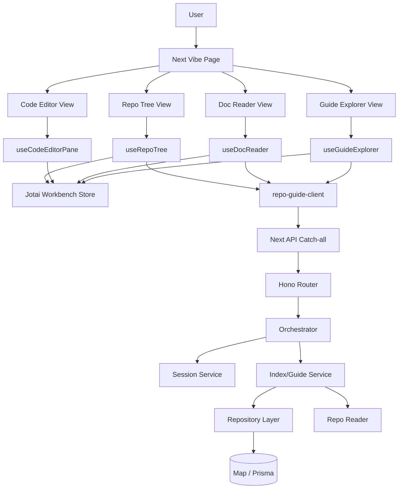
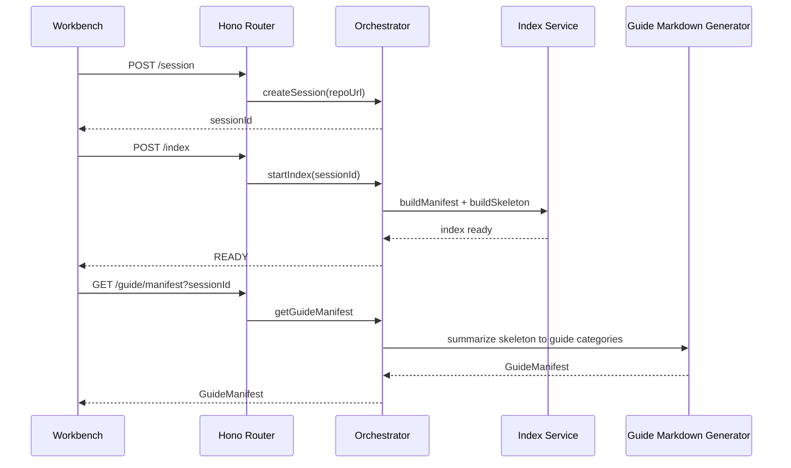
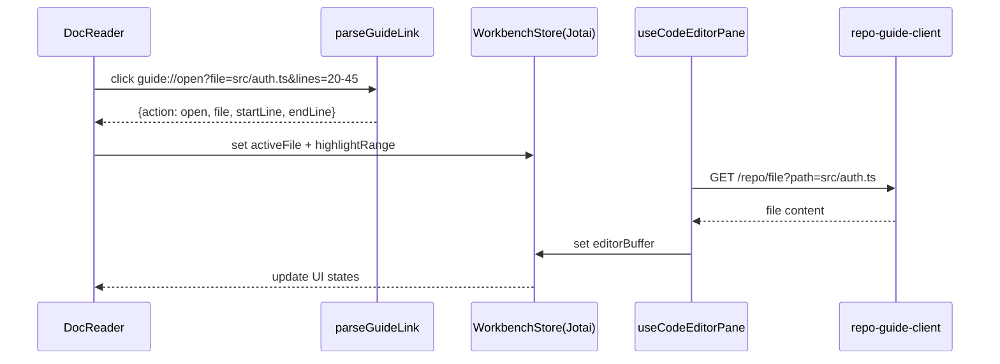

# System-01：Repo Guide Workbench 架构总览（四列布局版）

## 1. 架构目标（Why）
- **阅读不断流**：文档与代码同屏，不再切窗口。
- **证据可追溯**：文档里的每个结论都能跳回源码行号。
- **可拆可维护**：前端按 View/Logic 分层，后端按 Controller/Service/Repository 分层。
- **渐进式计算**：先索引再按需生成文档，避免全量分析导致延迟爆炸。

## 2. 全局技术决策
| 领域 | 决策 | 依据 |
| :--- | :--- | :--- |
| 后端框架 | Hono | `apps/web/server` 已是 Hono 主干，契合 Controller 层职责。 |
| 前端框架 | Next.js + React 19 | 当前项目基线。 |
| 布局实现 | `react-resizable-panels` + Tailwind | 已有依赖，支持四列工作台的可调宽布局。 |
| 状态管理 | Jotai（跨列共享） + 局部 `useState`（瞬时 UI） | `jotai` 已在依赖中，适合 Workbench 跨列联动。 |
| Markdown 渲染 | `react-markdown` + `remark-gfm` | 支持文档视窗与自定义链接拦截。 |
| 代码视窗 | `@monaco-editor/react` | 已有依赖，满足只读高亮与定位需求。 |
| API 校验 | Zod + `@hono/zod-validator` | 统一输入边界。 |
| AI 调度 | `ai` + `@ai-sdk/openai` + DeepSeek | 已有 `lib/ai.ts`，可复用。 |
| 样式体系 | Tailwind（含 design token） | 与现有 `vibe` 页面一致。 |

## 3. 前端布局策略（必须项）

### 3.1 四列工作台（Quad Layout）
- **Col 1（250px）**：Guide Explorer（导游目录）
- **Col 2（可伸缩，默认 40%）**：Doc Reader（Markdown）
- **Col 3（可伸缩，默认 40%）**：Code Editor（Monaco 只读）
- **Col 4（250px）**：Repo Tree（真实文件树）

### 3.2 响应式约束
- 宽屏（>=1440）使用完整四列。
- 中屏（1024~1439）保留四列但允许 Col2/Col3 最小宽度 320px。
- 小屏（<1024）降级为双列（文档+代码），侧栏折叠为抽屉。

### 3.3 状态策略
- **Jotai 原子（跨列共享）**：
  - `activeDocIdAtom`
  - `activeFileAtom`
  - `highlightRangeAtom`
  - `focusModeAtom`
  - `expandedTreeKeysAtom`
- **局部状态（组件内）**：输入框、loading、toast 开关等短生命周期状态。

### 3.4 请求分层标准
- `services/repo-guide-client.ts`：仅封装 fetch + DTO 解析。
- `hooks/useRepoGuideWorkbench.ts`：编排请求、状态转换、错误处理。
- `components/*.tsx`：纯展示，不直接 fetch。

## 4. 分层架构（前后端）



## 5. 组件树（Mermaid，必须项）

```mermaid
graph TD
P[app/(desk)/vibe/repo-guide/page.tsx]
P --> W[RepoGuideWorkbench]
W --> L[QuadWorkbenchLayout]
L --> C1[GuideExplorer]
L --> C2[DocReader]
L --> C3[CodeEditorPane]
L --> C4[RepoTree]

W --> H0[useRepoGuideWorkbench]
C1 --> H1[useGuideExplorer]
C2 --> H2[useDocReader]
C3 --> H3[useCodeEditorPane]
C4 --> H4[useRepoTree]

C2 --> MR[MagicMarkdownRenderer]
MR --> LP[parseGuideLink]
```

## 6. 关键时序图

### 6.1 全局索引流程（US-1）


### 6.2 魔法链接联动（US-2）


## 7. 后端分层约束（Controller-Service-Repository）
- **Controller（Router）**：解析请求、校验、返回 HTTP。
- **Service**：会话、索引、文档生成、魔法链接上下文转换。
- **Repository**：封装数据存取（Map/Prisma），Service 不直接操作底层存储对象。

## 8. 架构落地文件清单（阶段 1 目标）
- 既有核心：`server/services/vibe/repo-guide/*`, `server/routers/vibe-repo-guide.ts`
- 前端新增（规划）：
  - `app/(desk)/vibe/repo-guide/components/QuadWorkbenchLayout.tsx`
  - `app/(desk)/vibe/repo-guide/components/GuideExplorer.tsx`
  - `app/(desk)/vibe/repo-guide/components/DocReader.tsx`
  - `app/(desk)/vibe/repo-guide/components/CodeEditorPane.tsx`
  - `app/(desk)/vibe/repo-guide/components/RepoTree.tsx`
  - `app/(desk)/vibe/repo-guide/hooks/*.ts`
  - `app/(desk)/vibe/repo-guide/services/repo-guide-client.ts`
  - `app/(desk)/vibe/repo-guide/store/workbench-atoms.ts`
  - `app/(desk)/vibe/repo-guide/lib/magic-link.ts`

## 9. 非目标
- 不支持在线编辑提交代码（只读）。
- 不做复杂多 Tab 管理（MVP 单文件焦点）。
