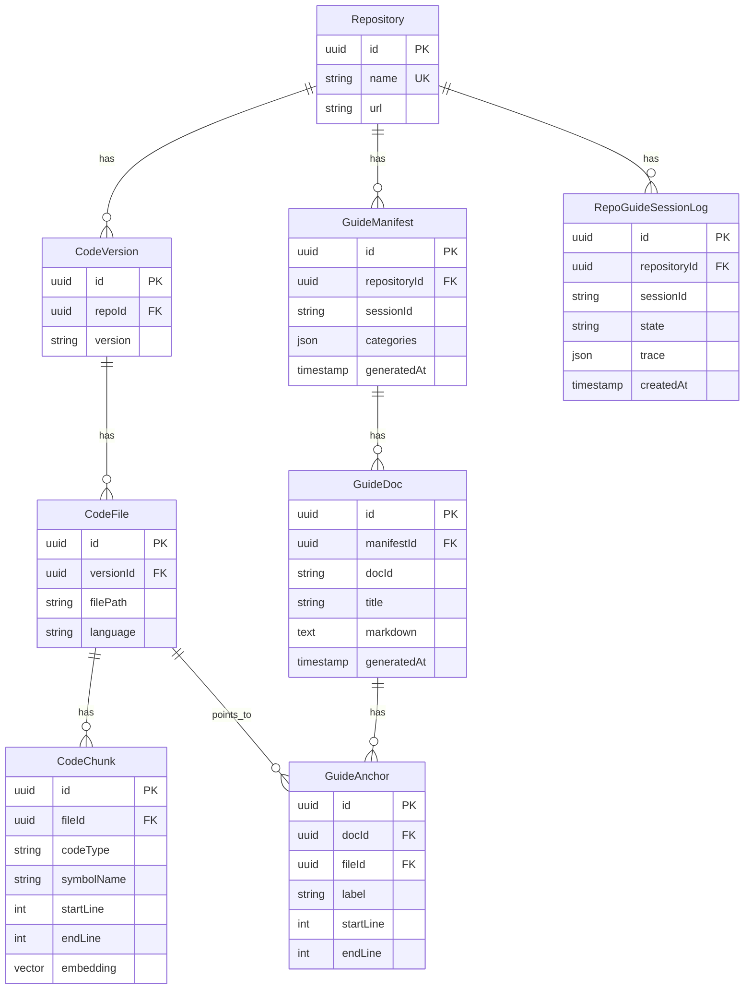

# System-03：数据模型与存储策略（Guidebook 版）

## 1. 目标
- 支撑四列工作台最小读链：目录（Col1）-文档（Col2）-代码（Col3）-文件树（Col4）。
- 区分“索引资产”与“导游内容”，便于缓存与增量更新。

## 2. 当前实现（V1）
- 运行态内存存储（Map）：`session/index/manifest/skeleton/memory`。
- 优点：迭代快。
- 风险：进程重启丢失、无法跨实例共享。

## 3. V2 目标（Prisma 持久化）
- 复用已有：`Repository`, `CodeVersion`, `CodeFile`, `CodeChunk`。
- 新增建议：`GuideManifest`, `GuideDoc`, `GuideAnchor`, `RepoGuideSessionLog`。

## 4. 逻辑 ER 图（Mermaid）

## 5. 字段约束建议
- `GuideDoc(manifestId, docId)` 唯一。
- `GuideAnchor(docId, fileId, startLine, endLine)` 索引。
- `CodeChunk(symbolName)` 索引用于 focus 跳转。

## 6. 写入时机
| 时机 | 写入 | 目的 |
| :--- | :--- | :--- |
| session 创建 | `RepoGuideSessionLog` | 可追踪用户链路 |
| index 完成 | `CodeFile + CodeChunk(skeleton_symbol)` | 代码地图缓存 |
| manifest 生成 | `GuideManifest` | Col1 目录缓存 |
| doc 生成 | `GuideDoc + GuideAnchor` | Col2 文档与跳转锚点缓存 |

## 7. 生命周期
- SessionLog：7~30 天。
- GuideManifest/GuideDoc：按 `repoKey + branch` 缓存，可增量刷新。
- Code 索引资产：长期保留，按最近访问淘汰。
