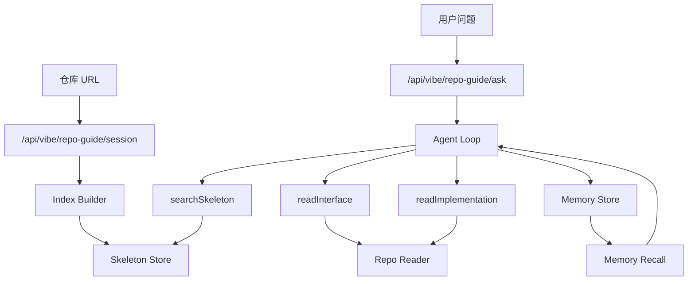

架构：

模块化实现方案（按目录拆）

Session 模块（不调 AI）

放：session.ts
职责：输入 repoUrl + branch，输出 sessionId + repoKey(owner/repo@sha)。
关键：repoKey 用来做缓存命中和增量更新。
Discovery 模块（不调 AI）

放：discovery.ts
职责：基于 listDirectoryContent 做受控遍历，生成可读文件清单。
输出：manifest.json（路径、语言、大小、hash、是否可索引）。
Skeleton Indexer 模块（不调 AI）

放：skeleton-indexer.ts
职责：抽“签名”不读函数体（class/function/interface/import/export）。
技术建议：TS/JS 先用项目已有 @ast-grep/napi，多语言再接 python-service + tree-sitter（二期）。
输出：skeleton.json（你 SPEC 里那种结构）。
Interface Reader 模块（不调 AI）

放：interface-reader.ts
职责：实现 read_interface(path)，只返回 import + 注释 + 签名，函数体折叠。
作用：让模型低 token 快速建立“航拍视角”。
Implementation Reader 模块（不调 AI）

放：impl-reader.ts
职责：实现 read_implementation(path, symbol|lineRange)，只读关键 50~200 行。
作用：街景视角，最后一跳才读。
Tool Facade 模块（不调 AI）

放：tools.ts
暴露 3 个工具：searchSkeleton、readInterface、readImplementation。
关键：别把 bash 暴露给模型，模型只看高级工具。
Agent Loop 模块（调 AI）

放：agent-loop.ts
状态机：LOCATE -> OVERVIEW -> DIG -> ANSWER，每轮最多一步工具调用，maxSteps=8~10。
何时调 AI：只在“决策下一步”和“最终讲解”两类节点调。
Memory 模块（轻量调 AI）

放：memory.ts
短期记忆：session 内保存“读过哪些文件 + 提炼出的关键点”。
长期记忆：文件级 summary 向量化入库（可复用你 Prisma 里的 code 相关表，或先 JSON cache 后 DB）。
时机：每次 readImplementation 后异步总结并写入，不阻塞当前回答。
API 模块（vibe 路由）

放：/Users/mrlonely/mrlonely/mrlonely-code/gitclone/SyncScribe/fe-next/apps/web/app/api/vibe/repo-guide/*
建议端点：
POST /session：创建会话并解析仓库
POST /index：触发索引（可异步）
GET /index/status：查索引进度
POST /ask：进入 agent loop 并流式返回讲解
这样符合 AGENTS 的 vibe API 约束。
前端模块（vibe 页面）

放：page.tsx
子组件：Repo 输入、索引进度、问答区、源码跳转卡片。
输出形态：按你 SPEC 的教学风格，回答里固定给“直觉/心智模型/链路/源码链接”。

你现有底座可复用：

仓库读取能力：github.ts (line 363)
Hono 总入口：app.ts (line 9)
Next 到 Hono 转发：route.ts (line 15)
DeepSeek client：ai.ts (line 16)
一、先建这些模块（文件级）

路由层

vibe-repo-guide.ts
提供 4 个端点：session / index / status / ask
编排层（Orchestrator）

orchestrator.ts
负责把“建会话→建索引→问答循环”串起来
类型层

types.ts
所有 DTO、工具输入输出、状态机定义
索引层（不调 AI）

manifest-builder.ts
skeleton-indexer.ts
index-store.ts
读取层（不调 AI）

interface-reader.ts
implementation-reader.ts
Agent 层（调 AI）

agent-loop.ts
prompts.ts
tool-facade.ts
记忆层

memory.ts
V1 先 session 内存 + 文件缓存，V2 再接 pgvector（可复用你现有 schema 的 Code* 表）
前端(vibe)

page.tsx
RepoGuideWorkbench.tsx
二、核心接口草图（你可以直接照着写）

// repo-guide/types.ts
export type IndexState = 'CREATED' | 'INDEXING' | 'READY' | 'FAILED';

export type RepoGuideSession = {
  sessionId: string;
  repoUrl: string;
  branch: string;
  repoKey: string; // owner/repo@sha or local@mtime
  state: IndexState;
  createdAt: string;
  updatedAt: string;
  error?: string;
};

export type SkeletonSymbol = {
  kind: 'class' | 'function' | 'method' | 'interface' | 'type' | 'const' | 'export';
  name: string;
  signature?: string;
  line?: number;
};

export type SkeletonFile = {
  path: string;
  language: string;
  symbols: SkeletonSymbol[];
};

export type SkeletonIndex = {
  repoKey: string;
  generatedAt: string;
  files: SkeletonFile[];
};

export type SearchSkeletonHit = {
  path: string;
  score: number;
  matchedSymbols: string[];
};

export type InterfaceSnapshot = {
  path: string;
  language: string;
  content: string;      // 折叠函数体后的文本
  startLine: number;
  endLine: number;
  blobUrl: string;
};

export type ImplementationSnapshot = {
  path: string;
  language: string;
  content: string;      // 精确窗口
  startLine: number;
  endLine: number;
  blobUrl: string;
};
三、API 设计（Hono）

POST /api/vibe/repo-guide/session

入参：{ repoUrl, branch? }
出参：{ sessionId, repoKey, state }
POST /api/vibe/repo-guide/index

入参：{ sessionId, force?: boolean }
行为：异步启动索引（manifest + skeleton）
GET /api/vibe/repo-guide/status?sessionId=...

出参：{ state, progress, stats }
POST /api/vibe/repo-guide/ask

入参：{ sessionId, question, maxSteps?: number }
出参：流式文本 + 结构化“证据列表”（读过哪些文件）
四、Agent 循环（关键）

状态机：LOCATE -> OVERVIEW -> DIG -> ANSWER
工具仅 3 个（不要给 bash）：
searchSkeleton(query, limit)
readInterface(path)
readImplementation(path, startLine, endLine | symbolName)
终止条件：
命中足够证据（>=2 文件）
或 steps 达上限（默认 8）
每轮产物：
thought(摘要) + toolCall + observation(压缩)
最后输出：
人话讲解 + 文件定位链接（带行号）
五、什么时候调用 AI（你问的重点）

建索引阶段：默认不调用 AI（纯 AST/规则，快且便宜）
问答阶段：只在两处调用 AI
决策下一步读哪
生成最终讲解
读后存储阶段：异步小模型生成文件摘要（可选），写入长期记忆
六、存储策略（短期/长期）

短期记忆（必须）
session 内：已读文件、命中符号、关键结论、tool trace
长期记忆（建议）
复用你现有 Prisma 的 Repository/CodeVersion/CodeFile/CodeChunk
CodeChunk.codeType 用：skeleton_symbol | file_summary | impl_fact
向量化后支持“下次先 recall 再读文件”